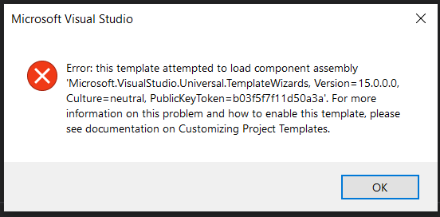

# HelloWinRT
C++/WinRT is an entirely standard modern C++17 language projection for Windows Runtime (WinRT) APIs, implemented as a header-file-based library, and designed to provide you with first-class access to the modern Windows API.

### Features

- Uses the windows API to create a GUI

### Issues
Whenever I try to create a project under the template, Windows Console Application (C++/WinRT), I get the following error. I have tried downloading the C++/WinRT Visual Studio Extension and/or the UWP essentials extension, but this had no success.

### Built with

- C++
- Visual Studio
- C++ WinRT VISX

### Acknowledgement 
- https://docs.microsoft.com/en-us/windows/uwp/cpp-and-winrt-apis/get-started?view=msvc-160

